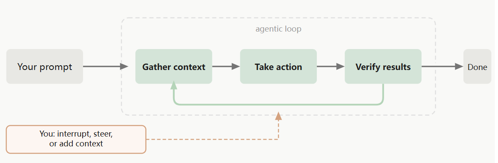
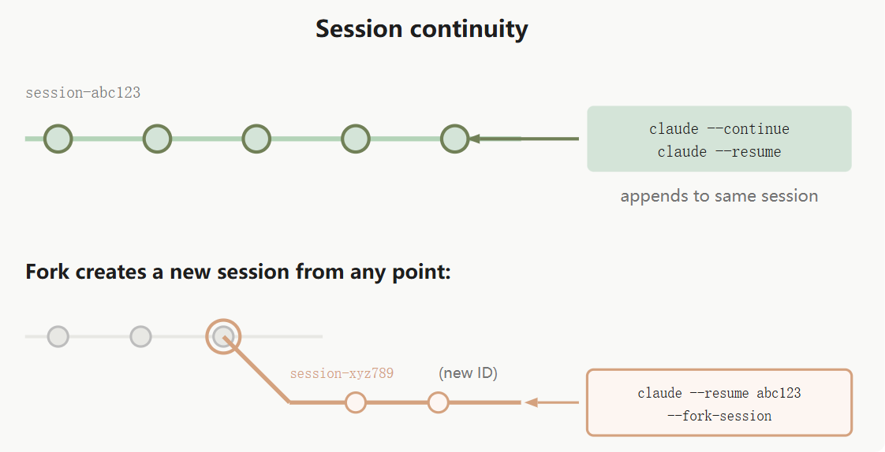

## 概述

Claude Code 是 Anthropic 推出的面向开发者的 AI 编程协作工具。与网页版 Claude 不同，Claude Code 在终端中运行，能够读取项目代码、理解文件间关系、直接修改文件并执行指令。

核心特征：

- **上下文感知**：理解整个项目结构，而非单一文件
- **工程化导向**：关注可维护性、规范与测试
- **可定制行为**：通过 Skills（技能包）定义特定编码规则

| 对比维度 | Claude（网页版） | Claude Code |
|---------|-----------------|-------------|
| 运行环境 | 浏览器 | 终端 |
| 交互方式 | 复制代码片段提问 | 直接访问项目文件系统 |
| 代码修改 | 仅提供建议 | 可直接编辑文件 |
| 项目理解 | 仅限粘贴内容 | 理解完整项目结构 |

## 功能特性

### 代码理解与解释

支持以下查询类型：

- 函数功能与逻辑分析
- 错误原因定位
- 性能瓶颈识别

Claude Code 结合项目上下文给出解释，而非孤立分析代码片段。

### 多文件上下文分析

区别于单文件代码补全工具，Claude Code 能够理解：

- 函数调用关系与引用链
- 模块依赖拓扑
- 项目整体架构

### 工程级代码修改

支持批量代码重构指令，例如：

- 将 `var` 声明统一替换为 `let`
- 拆分长函数为多个子函数
- 为接口批量添加错误处理

Claude Code 直接修改源文件，而非仅输出建议。

### Skills 扩展能力

Skills 是 Claude Code 的核心扩展机制，允许开发者将编码习惯与团队规则注入 AI 行为。典型场景：

- 强制函数注释规范
- 约束 API 响应格式
- 要求测试用例覆盖边界条件

## 局限性

Claude Code 在以下场景存在限制：

- 技术决策的最终判断需由开发者确认
- 生成代码无法保证 100% 无缺陷
- 无法理解未被明确描述的业务语义
- 不适用于开发者完全不理解代码逻辑的全自动接管

## 工作原理

### 工作流程

Claude Code 以循环方式处理任务，每个循环包含三个阶段：

1. **收集上下文**：读取代码、文件、错误信息
2. **执行操作**：编辑文件、运行命令、搜索
3. **验证结果**：检查执行状态并决定是否调整

三个阶段持续循环直至任务完成。用户可随时中断、调整方向或切换策略。

该循环由模型和工具两大部分驱动。

### 模型

Claude Code 使用 Anthropic 的 Claude 系列模型进行代码理解与任务规划。模型能够识别多种编程语言，理解项目结构，并将复杂任务拆解为可执行的子步骤。

推荐模型选择：

- **Sonnet**：适用于日常编码任务（速度快、性价比高）
- **Opus**：适用于复杂架构设计与深度推理场景

### 工具

Claude Code 内置五类工具：

| 工具类别 | 功能 |
|---------|------|
| 文件操作 | 读取、编辑、创建、重命名文件 |
| 搜索 | 按文件名或正则表达式检索代码 |
| 命令执行 | 运行 npm、git、测试、服务启动等 |
| 网络搜索 | 查阅文档与错误信息 |
| 代码智能 | 类型检查、定义跳转、引用查找（需安装语言插件） |

实际工作流示例（修复失败测试）：

1. 运行测试定位失败用例
2. 阅读错误日志
3. 搜索相关源文件
4. 分析代码逻辑
5. 修改代码
6. 重新运行测试验证

### 访问范围

Claude Code 的可见范围包括：

- 项目目录及其所有子文件
- 终端可执行的任意命令（npm、git、构建工具等）
- 当前 Git 状态（分支、未提交变更、提交历史）
- `CLAUDE.md` 文件（项目专属规则定义）
- 自动记忆（项目习惯记录，存于 `MEMORY.md` 前 200 行）
- MCP、Skills 等扩展配置

### 跨分支工作

Claude Code 的会话与文件夹绑定，而非与 Git 分支绑定。实际效果：

- 切换分支（`git checkout` / `git switch`）后，Claude Code 自动读取新分支文件
- 聊天记录在分支切换后保持不变，上下文不丢失
- 同一文件夹下的不同分支共享会话历史

多分支并行开发建议：使用 `git worktrees` 为每个分支创建独立目录，各分支拥有完全隔离的对话记录，互不干扰。

### 上下文窗口

Claude Code 存在上下文容量限制。接近上限时的处理方式：

- 自动压缩旧内容
- 通过 `/compact` 手动压缩
- 通过 `/context` 查看当前占用情况

减少上下文占用的策略：

- 将重要规则写入 `CLAUDE.md`
- 使用 Skills 和 Subagents 减少不必要的内容注入

### 安全机制

**检查点**：Claude Code 修改文件前自动创建备份。双击 Esc 或输入撤销指令即可回退至修改前状态。

**权限模式**（Shift + Tab 快速切换）：

| 模式 | 行为 |
|------|------|
| 默认 | 文件修改与命令执行均需确认 |
| 自动接受编辑 | 文件修改无需确认，命令仍需确认 |
| 计划模式 | 仅分析与规划，不执行实际操作 |

可在 `.claude/settings.json` 中将特定命令加入白名单（如 `npm test`），跳过确认步骤。

### 使用建议

1. 向 Claude Code 询问自身用法：输入 `/init` 或具体问题获取引导
2. 采用对话式交互：先描述大致需求，根据结果迭代修正，无需每次重写完整提示
3. 随时中断：方向偏离时直接输入新指令，Claude Code 立即调整
4. 提供具体提示。错误示例："修复登录错误"。正确示例："持卡人过期的用户结账流程异常，检查 `src/payments/` 目录，重点关注令牌刷新逻辑，先编写失败测试再修复"
5. 要求自行验证：附带测试用例或预期结果，Claude Code 执行后自动确认
6. 先探索后实现：使用计划模式（Shift+Tab 两次）分析代码库并输出完整计划，审核通过后再执行

## 参考文档

- [菜鸟教程 — Claude Code 教程](https://www.runoob.com/claude-code/claude-code-tutorial.html)
- [Claude Code 中文官方文档](https://code.claude.com/docs/zh-CN/overview)
